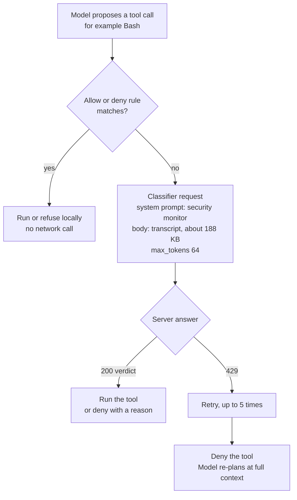
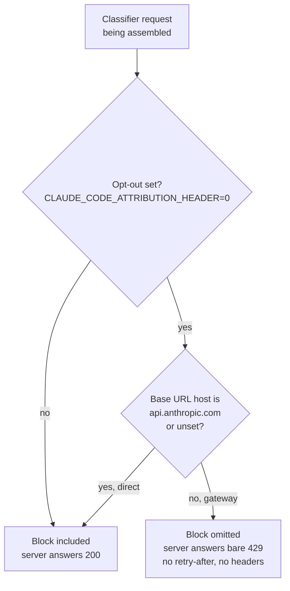

# Why Auto Mode Broke Behind the Gateway

Auto-mode tool calls were denied in bursts on 13 to 18 August and again from 6 September, with the usage meter running hot on light days. Root cause found, fixed and verified 9 September 2026. Written by Claude Fable 5.1 from a background job on binky; the raw data and the eight-seat council review are listed at the end.

## One setting and one URL check produced every 429

Two things had to be true at once for a classifier call to fail. The settings file carried `CLAUDE_CODE_ATTRIBUTION_HEADER=0`, an opt-out that has sat there since 31 March. And the request had to leave through a base URL that is not `api.anthropic.com`, which is what the model-router gateway is. Either one alone is harmless. Together, Claude Code sends the classifier request without a block the server insists on, and the server answers a bare 429 in 0.3 seconds. Removing the opt-out ends it, and the gateway stays.

## Auto mode makes a second, hidden request for every tool call

When the model proposes a tool call in auto mode, Claude Code does not run it straight away. It sends a separate request to a classifier, with the transcript attached, asking whether the action is safe. That request never appears in the session transcript file, so a scan of transcripts undercounts what the meter sees. The classifier runs on the session's model tier: Sonnet sessions classify on Sonnet, Fable sessions on Opus 5 with the 1M window.

The re-plan is where the visible cost comes from. Every denied Bash sends the whole conversation back to the main model, at about 190k tokens on a typical session here, and the model tries a different route that gets denied again.

## Claude Code drops the attribution block whenever both conditions hold

The attribution block is a short text line Claude Code puts into the system prompt of its own requests, naming the client and billing context. The opt-out variable suppresses it. Claude Code 2.1.229 added a repair for the classifier path, because the server rejects classifier requests without the block (Anthropic tracks this as [issue 64585](https://github.com/anthropics/claude-code/issues/64585), the resolution of [issue 60438](https://github.com/anthropics/claude-code/issues/60438)). The repair has a guard: it only re-adds the block when the base URL is unset or its host is literally `api.anthropic.com`. The `_CLAUDE_CODE_ASSUME_FIRST_PARTY_BASE_URL` flag that the gateway sets is checked by a different function and does not reach this one.

Every captured request from the 8 September A/B lacked the block, on both arms, because both arms went through a loopback proxy URL. That is why that A/B showed no difference: it compared two failing paths and concluded, wrongly, that the router was innocent and Anthropic was throttling the account. The router was innocent, but for the reason above, not because the throttle was elsewhere.

## The two-week quiet spell was the gateway being off

The opt-out was present the whole time, so the only variable that moved is whether sessions went through the gateway. Each row is one local day; CLI versions come from the transcripts, 429 counts from the "cannot determine the safety" errors in them.

| Day | Sessions via gateway | Classifier 429s | CLI version |
|---|---|---|---|
| Aug 12 | no | 0 | 2.1.229 |
| Aug 13 | yes, wired 23:32 | 4 | 2.1.231 to 2.1.232 |
| Aug 15 | wired, but the router log shows no model traffic | 0 | 2.1.229 |
| Aug 17 | yes | 10 | 2.1.234 |
| Aug 18 | yes, unwired that day | 13 | 2.1.234 |
| Aug 19 to Sep 3 | no | 0 every day | 2.1.234 to 2.1.260 |
| Sep 4 | no | 2 | 2.1.261 |
| Sep 5 | no | 0 | 2.1.261 to 2.1.263 |
| Sep 6 | yes, rewired 04:33 | 124 | 2.1.263 |
| Sep 8 | yes | 100 | 2.1.263 to 2.1.266 |
| Sep 9 | yes | 14 | 2.1.267 |

The fix for direct connections shipped in 2.1.229, before this window opens. So on every day since, direct sessions worked and gateway sessions failed, whatever the CLI version. That is the "went away for two weeks, came back 14 hours ago" shape: the gateway was unwired on 18 August and rewired on 6 September.

## Removing the setting fixed it and the gateway stays wired

The opt-out was removed from the live settings and committed as `b2868c8a`. The same headless auto-mode probe, one Bash command that creates and removes a file, ran before and after.

| Probe | Classifier outcome | Result |
|---|---|---|
| Sep 8, through router, opt-out set | 15 requests, 15 × 429 | max turns, every Bash denied, $0.25, command never ran |
| Sep 8, direct via proxy URL, opt-out set | 15 requests, 15 × 429 | same |
| Sep 9, through router, opt-out removed | verdicts returned | success, "done", 0 denials, 3 turns |
| Sep 9, direct, opt-out removed | verdicts returned | success, "done", 0 denials, 3 turns |

## The router could not have fixed this

The router never sees the block. Claude Code decides not to include it before the request leaves the process, so there is nothing for the router to forward or repair. The router could forge the line itself, but that would mean synthesising Anthropic's billing attribution on the client's behalf, which is the wrong side of the boundary and a plausible way to get an account flagged. The gap sits in Claude Code: its repair keys on the raw URL host instead of honouring the first-party flag it offers for exactly this gateway case. That is worth filing upstream. Until then, not setting the opt-out is the clean fix, and it costs nothing: the block is a billing attribution line, not data about the work.

## What this does not fix

The 429s and the denial loops are gone. Three cost drivers are untouched, and were flagged by seven of eight council seats as the part the first diagnosis got backwards, since the heaviest spend days (2 to 4 September) had almost no 429s.

- Every non-allowlisted tool call in auto mode still costs one classifier request on the session's model tier, about 47k mostly cached tokens each. Now that they succeed, they are billed where the 429s probably were not.
- Long contexts. 29% of last week's requests carried 200k tokens or more, and 6% carried 400k or more. Compacting at task boundaries is the lever.
- Nine parallel auto-mode sessions are nine classifier streams.

The levers the council agreed on: narrow `permissions.allow` rules for the read-only Bash patterns agents use most, deny rules and deterministic local PreToolUse hooks as classifier-free fast paths, a hook that stops a job after repeated identical denials, and compaction before 200k. Each allow rule's effect can be checked by counting classifier requests in the router log before rolling it out.

## Provenance

- Handover with the step list: `~/vault/tooling/dotfiles/docs/2026-09-09_handover-auto-mode-classifier-429.md`
- Timeline report, with the withdrawn first diagnosis left in place: `~/vault/tooling/dotfiles/docs/2026-09-06-usage-spike-diagnosis.md`
- Captures, probes, council brief and the 659-line council result: `~/.claude/jobs/49656f9b/tmp/` (job-local, reaped with the job)
- Code path: Claude Code 2.1.263, function `D4t` in the bundled CLI, guard `ignoreEnvOptOut && provider firstParty && ev()`, where `ev()` tests the `ANTHROPIC_BASE_URL` host against `api.anthropic.com`
- Council: `openrouter-cli council ask`, eight seats plus Claude Fable 5 as chair, $3.93, 8 September 2026. The Grok 4.6 seat supplied the pointer to issue 60438
