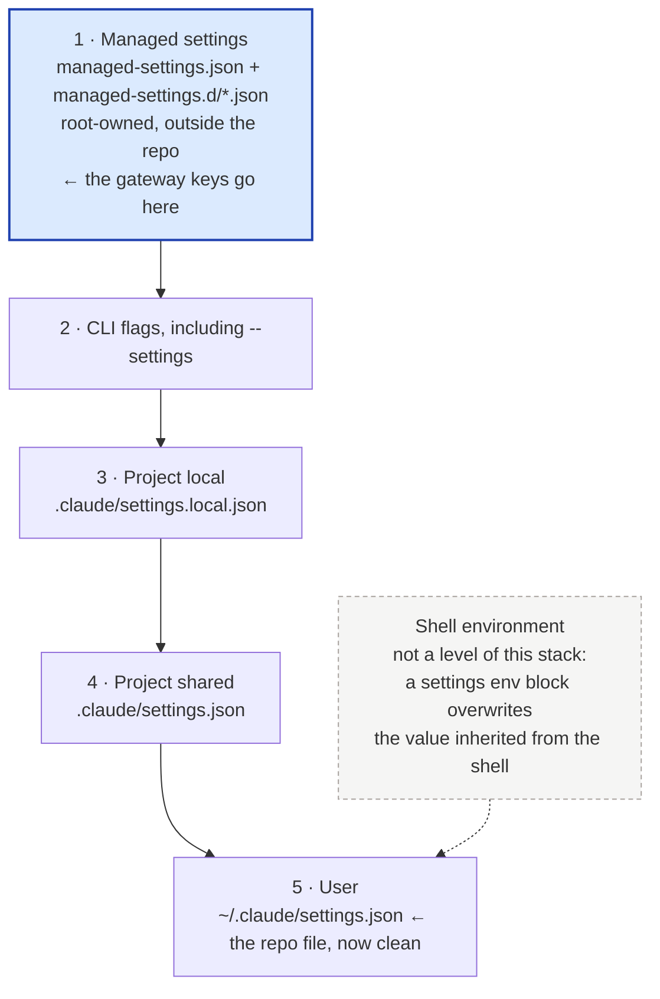

# The gateway keys move out of a public file

PR [#117](https://github.com/yulonglin/dotfiles/pull/117) moves the model-router gateway keys out of `claude/settings.json` and into a root-owned managed settings drop-in. This explains what that means, what it buys, what it costs, and what I think you should do. Nothing here has run on a real machine yet — see [What has and has not been verified](#what-has-and-has-not-been-verified).

## One file cannot be both live and committable

`~/.claude` is a symlink to this repo's `claude/` directory. So `~/.claude/settings.json` — the file Claude Code actually reads — and the committed `claude/settings.json` are the same bytes on disk. That is the whole design, and it is why editing settings here changes your running environment immediately.

The model-router gateway needs `env.ANTHROPIC_BASE_URL` set to the router's loopback endpoint, whose shape is `http://127.0.0.1:<port>/t/<token>`. That token is a per-install ingress credential, and the port is machine-local. This repo is public. So the file has to carry the key for the gateway to work, and must not carry it for the repo to be safe. There is no version of the file that satisfies both, and the diff therefore never resolves — it is a permanent uncommitted change on a file that Claude Code itself also rewrites whenever you run `/model` or `/plugin`.

That permanent diff is not free. Four costs, all of them live today:

- **Merges abort.** Any merge or rebase that touches `claude/settings.json` stops on a dirty working tree. The daily `dotfiles-sync` job works around this by holding the file back whenever the pre-commit guard rejects it, so the machine-local diff never blocks the push — a workaround that exists only because of this.
- **A stash can capture a degraded stub.** The file is dual-written by Claude Code and by hand, so a stash or checkout taken at the wrong moment can save a partial file. `.claude/rules/dotfiles-settings.md` opens with a rule that you must never stage this file without first asserting it still has `statusLine`, `hooks` and `permissions`. That rule exists because the failure has happened.
- **Committing the file's other changes needs a manual dance.** Today the documented procedure is to write a stripped copy, `git hash-object -w` it, and `git update-index --cacheinfo` the resulting SHA into the index — because editing the live file to make it committable would change your running environment.
- **A bespoke guard exists solely to stop a leak.** `_validate_no_local_gateway` in `config/git-hooks/pre-commit` is there because gitleaks does not catch this value: a bare hex token sitting in a URL path has no adjacent secret keyword to trigger on. The guard is pinned by `tests/test_pre_commit_gateway_guard.sh`.

## A managed drop-in is a settings file the user cannot commit

Claude Code supports settings deployed by an organisation's administrator, called [managed settings](https://code.claude.com/docs/en/managed-settings). They live in a system directory rather than the user's home, they are owned by root, and Claude Code reads them **in addition to** the user's own settings — merging them by key, with the managed value winning wherever both set the same key.

There are two file shapes in that directory. `managed-settings.json` is the single shared file. Beside it, an optional `managed-settings.d/` directory holds one `*.json` file per concern; Claude Code merges `managed-settings.json` first, then every file in the directory in alphabetical order, which is why the convention is numeric prefixes like `50-model-router.json`. The directory exists so that several teams can each own part of one policy without editing a shared file. Here there is one owner, but the drop-in shape is still the right one: it leaves `managed-settings.json` free for anything else later.

The system directory is `/Library/Application Support/ClaudeCode/` on macOS and `/etc/claude-code/` on Linux and WSL.

The property that matters for this problem is simple. The drop-in is not in the repo, not under `~/.claude`, and not writable without root. There is no sequence of `git add` that can reach it, so the token cannot be committed by accident — not because a guard catches it, but because the file is not in the tree at all.

## Apply stages the file, one sudo line installs it

`model-router-wire apply` still reads `config/model-router.toml` as the single source, and still renders the router's route config and the generated `claude/agents/<id>.md` files exactly as before. What changes is the third output. Instead of writing the gateway keys into `~/.claude/settings.json`, it renders them to `~/.config/model-router/managed-settings.json` at mode 0600 — a *staged* copy, owned by you — and prints one command:

```
sudo install -d -m 0755 <system dir>/managed-settings.d && \
  sudo install -m 0644 -o root -g root <staged file> <system dir>/managed-settings.d/50-model-router.json
```

The migration is deliberately two-phase, and the ordering is the careful part. `apply` strips the gateway keys from `~/.claude/settings.json` **only** after the installed root-owned file byte-matches what it just staged. Run `apply`, and it stages and tells you to run sudo; run sudo; run `apply` again, and it now sees a matching drop-in and clears the user file. At no point is there a window where neither file carries the gateway, so no session ever silently falls back to direct Anthropic mid-migration. `tests/test_model_router_wire.sh` pins that ordering against temp paths.

**On a machine where the sudo step has not been run, nothing breaks.** The drop-in is absent, `apply` refuses to strip the user file, and that machine keeps working exactly as it does today — gateway on, permanent diff intact. `apply --check` reports the missing drop-in as drift and names it, and `model-router-wire status` prints a warning that the user file still carries the keys. Adoption is therefore per-machine and reversible: the benefit arrives on each machine only when you run sudo there, and until then that machine is in the state it is in now.

Going the other way, `off` strips the user file, deletes the staged copy, and prints the matching `sudo rm -f` line, because it cannot remove a root-owned file either.

To confirm it landed, start a fresh session and run `/status`. The `Setting sources` line names the source in parentheses: with a drop-in and no `managed-settings.json` beside it, that reads `Enterprise managed settings (drop-ins)`.

## Three costs, one of them recurring

**Root is needed on every content change, not just once.** This is the cost I would weigh heaviest, and the PR's own documentation does not state it plainly. The drop-in as the PR renders it contains the picker rows, so adding, removing or renaming a model in `config/model-router.toml` changes the drop-in's content and needs a fresh `sudo install`. What reads as a one-time setup step is actually a root prompt on every model-roster edit. [My recommendation below](#adopt-it-but-narrow-what-goes-in) is aimed squarely at this.

**`CLAUDE_RC_OVERRIDE` is structurally dead, not merely retired.** That escape hatch worked by handing Claude Code a `--settings` file with the gateway keys blanked, so one session could reach Anthropic directly and Remote Control would work. Managed settings sit above command-line arguments in the precedence stack, and the documentation is explicit that [a key you pass with `--settings` does not override the same managed key](https://code.claude.com/docs/en/settings#settings-precedence). Nor can a lower file remove a variable — a settings `env` block can only set one. So no per-session file can undo a managed `ANTHROPIC_BASE_URL`. Three candidate replacements, none of them clean:

- **Park the drop-in.** A root `mv` moves it aside and back, optionally behind a sudoers `NOPASSWD` rule for that one exact command. It works. It is ugly, it needs a root grant, and it is racy — any session that starts inside the window comes up ungated.
- **`CLAUDE_CODE_PROVIDER_MANAGED_BY_HOST`.** This variable is documented to make Claude Code ignore provider and endpoint variables such as `ANTHROPIC_BASE_URL` in settings files, managed ones included. On paper that is exactly the hatch. In practice it is meant to be set by platforms that embed Claude Code, it also makes Claude Code ignore model-selection keys from managed settings, and I have not tested it. Treat this as speculative.
- **Do not replace it.** Remote Control has been disabled since the gateway was wired — a non-Anthropic `ANTHROPIC_BASE_URL` disables it regardless of where the key lives — romp over Tailscale is the documented remote path, and `rc-direct-settings.json` is already archived. This is the honest default, and it costs nothing you are currently using.

**A malformed drop-in stops every session on the machine.** If a managed settings file cannot be parsed as a JSON object, Claude Code refuses to start and names the source, even when another admin source supplies a valid policy. A broken user settings file degrades; a broken managed file is fatal, and fixing it needs root. The file is machine-generated so this is unlikely, but the blast radius is larger than today's.

One claim in the PR that I would not lean on: the rule text says the drop-in means "every session on the machine gets the gateway whoever launched it — terminal, IDE extension, desktop app, the background-job daemon". That is true, but it is also true today, because the user settings file already covers all of those. It would only be a gain over wiring the gateway through the `claude()` shell wrapper, which was never the proposal. The real and sufficient benefit is committability.

## Managed wins, and the environment is not a level

Precedence runs top to bottom; a key set higher wins over the same key set anywhere below.



Two details that make the split work, both from the docs rather than from measurement. `modelPicker` is never merged across sources: Claude Code takes the whole lineup from the highest of managed settings, `--settings` and user settings that defines it, and ignores the key in project and local settings. And `env` is read from every admin source and merged per variable, so a lower admin source can fill in variables a higher one leaves unset.

Within the managed tier itself there is a second ranking — remote settings from a claude.ai organisation, then MDM or OS policy, then the files — and by default the highest source carrying any policy key wins outright rather than merging. The PR's rule text notes that a claude.ai org's server-managed settings would therefore outrank the drop-in. Worth a footnote: server-managed settings are only fetched when the session talks to Anthropic's API directly, and are skipped when `ANTHROPIC_BASE_URL` points elsewhere — which, once the drop-in is installed, it does. `~/.claude/remote-settings.json` is `{}` on this machine in any case.

## Adopt it, but narrow what goes in

**My recommendation: adopt, with one change — put only the two token-bearing keys in the drop-in.**

The problem being solved is real, the mechanism is the right one, and the two-phase ordering is carefully done. But only one thing in that file cannot be committed: the base URL, because it embeds the ingress token. `_CLAUDE_CODE_ASSUME_FIRST_PARTY_BASE_URL` goes with it since it is meaningless without it. The other three — `ENABLE_TOOL_SEARCH`, `CLAUDE_CODE_MAX_CONTEXT_TOKENS` and the whole `modelPicker` block — carry nothing secret. The picker rows in particular are rendered from `config/model-router.toml`, which is already committed in this public repo, so putting them behind a root-owned file protects nothing.

Narrowing the drop-in to those two keys keeps the entire committability win and changes the cost profile:

- Root is needed **once per install**, not on every model-roster edit. The drop-in's content then changes only when the router's port or token changes.
- The blast radius of a malformed managed file shrinks to two lines that nothing but `apply` ever writes.
- Editing the model roster goes back to being a plain `apply` plus a commit, with no privilege escalation in the loop.
- The picker rows become committable and reviewable in git, which they are not today.

The mechanics are a small change to `render_managed` and to the strip list in `model-router-wire`, plus the matching assertions in `tests/test_model_router_wire.sh`. **I have not made that change** — it alters the shape the PR is proposing, and that is your call rather than mine. If you would rather take the PR as written, it is coherent as it stands; the recurring sudo is the price.

Whichever way you go, the `CLAUDE_RC_OVERRIDE` question needs an explicit answer, and my lean is the third option: let it stay dead, and treat romp as the remote path.

## What has and has not been verified

Verified, by running it: `tests/test_model_router_wire.sh` passes, and it exercises staging, the mode-0600 staged file, the refusal to strip before the drop-in exists, the strip after it matches, a tampered drop-in reported as drift, and `off`. All four router suites pass — `test_model_router_wire.sh`, `test_ensure_model_router*.py` (29 tests), `test_model_router_update.py` (13), `test_update_ai_tools_gateway.py` (5).

Verified, against the published documentation: the system directory paths, the `managed-settings.d/` merge order, the precedence stack, that `--settings` cannot override a managed key, the `modelPicker` whole-value rule, the per-variable `env` merge across admin sources, the `/status` source labels, and the refuse-to-start behaviour on an unparseable managed file.

**Not verified: any of it running on a real machine.** No machine has the drop-in installed — `/etc/claude-code/` does not exist on this Linux box, and `~/.claude/settings.json` still carries all the gateway keys. The tests run against temp paths with a stub `bootstrap.sh`. The first real `sudo install` will be the first end-to-end exercise, which is an argument for doing it on one machine and living with it for a day before touching the others.

One defect the PR introduced, now fixed on the branch: both router hooks resolved `ANTHROPIC_BASE_URL` from the process environment first and `~/.claude/settings.json` second. A hook that a Claude Code session launches always has the variable, because Claude Code copies a settings `env` block into the process environment whichever level set it — so in-session recovery was fine. But `update-ai-tools` runs `check_model_router_update.py` from a plain shell, which has no such variable, and once `apply` strips the user file that lookup would have come back empty and the post-update router validation would have skipped in silence. The hooks now read the drop-in between the two, with regression tests that go red without the fix.

## Why `custom_bins/` holds a Python program with no `.py`

Because `custom_bins/` is on `PATH` and holds **commands**, not importable modules, and a command is invoked by its bare name. `secrets`, `figcheck`, `md2artifact`, `any2md`, `utc_date` — none of them would read right as `secrets.py`, and the extension would then have to appear in every invocation, every alias and every script that calls them.

I checked rather than assumed, and the repo is consistent. `custom_bins/` holds 80 entries. Exactly one carries an extension: `_annotation_layer.py`. It is the only entry that is **not** a command — it has no execute bit (`rw-rw-r--`), no shebang, and it is imported as a module by `custom_bins/md2artifact`, `custom_bins/annotate-html` and `tests/test_annotate_html.py`. Its leading underscore says the same thing.

Eleven Python programs sit in there with no extension, `model-router-wire` among them: `annotate-html`, `any2md`, `app-lifecycle-config`, `check-transcripts`, `claude-config-sync`, `claude-jobs-reap`, `claude-usage-audit`, `figcheck`, `md2artifact`, `model-router-wire`, `openrouter-cli`. So the rule the directory actually follows is "extension if and only if it is a module, never if it is a command", and `model-router-wire` is on the right side of it. Its language is declared where it belongs, in the shebang — here `#!/usr/bin/env -S uv run --quiet --script`, which also pins `requires-python >= 3.11`, because an earlier `#!/usr/bin/env python3` resolved to Apple's 3.9 on macOS and could not import `tomllib`.
