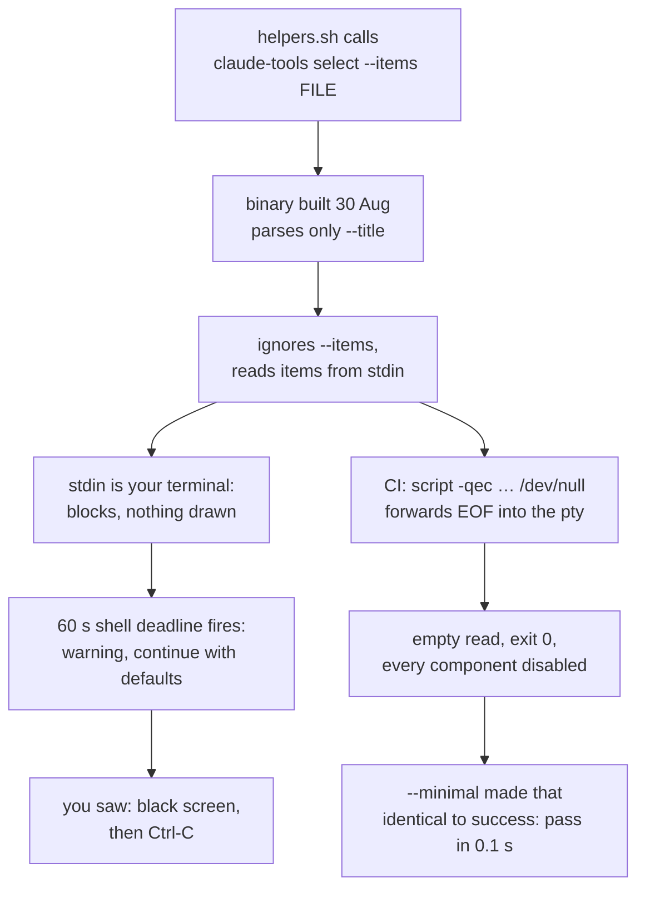

# Installer Stall Pulse

Status of the `./install.sh` / `./deploy.sh` stall fix as of 2026-09-04 20:15 PDT. Branch `worktree-installer-stall`, [PR #95](https://github.com/yulonglin/dotfiles/pull/95). Written for one pass; the decisions you own are at the end.

## The menu is back, in Rust, and it can no longer go dark

- **Fixed and verified on macOS.** On a terminal nobody types at, the menu draws in about 0.1 s, times out to the profile's set, and the run completes. Enter confirms the pre-checked set; Esc keeps it. Both installers print the resolved component list in their banner and refuse to run an empty set.
- **Not yet in your main checkout.** Running `./deploy.sh` from `/Users/yulong/code/dotfiles` still shows the 60-second black screen until PR #95 is merged and main is pulled.
- **CI on the branch:** the Linux runs pass end to end, including the cargo build, the contract test, the silent-pty suite and both mutation checks. The macOS build job failed once on a bash 3.2 quirk in the test harness; the fix is pushed and the rerun is in progress.

## What went wrong was a contract, not a flag

- **The `--items` flag was added to the Rust side on 17 June and lost in the 21 June merge**, while the shell kept passing it. The binary ignored what it did not recognise, so nothing failed loudly.
- **Every stall check asserted a deadline, and the deadline worked.** That is why the canary stayed green for eleven weeks: a warning after 60 seconds is a pass to a deadline test and a stall to a person.
- **A second bug hid under the first.** An empty selection disabled all 57 components and printed "Deployment complete!". CI had also been red since 1 September over two components missing from the golden fixtures, a separate drift.

## The fix hardens three things so the same class cannot recur

- **The binary refuses to misbehave quietly.** `claude-tools select` rejects unknown flags (exit 2), refuses to read items from a terminal (exit 2), draws before it reads anything, and carries its own idle deadline (exit 3). The last one matters because a fresh Mac has no `timeout(1)` until install.sh has installed coreutils.
- **The shell says out loud every way the menu did not run**, and keeps the profile's set in each case: cancelled, unanswered, wrapper deadline, binary missing for this platform, any other exit. An empty confirmation keeps the set too. The download-from-GitHub-release bootstrap is gone; binaries are committed per platform.
- **CI reproduces the report instead of reasoning about it.** A Python pty driver holds stdin open and silent, the profile is non-minimal so "deployed nothing" is distinguishable from success, and the suite asserts the menu drew, the run finished inside 20 s, and the profile was deployed. Two mutation runs must go red: a stub binary that reads stdin, and a planted 25 s sleep. The binary is built from source in CI before these run, so the test can never lag the source the way a committed binary does.

## Rust, not Go, and it matters less than the contract

- **The repo has one Rust crate and no Go.** `tools/claude-tools` already ships the statusline, timezone, context and ignore tools; `select` is one more subcommand in it. A Go menu would add a second toolchain and a second binary supply chain for no capability the Rust one lacks.
- **What matters is not the language but the two things any compiled menu shares:** a per-platform binary that must be built and committed, and an argument contract with the shell that can drift. Both are now tested against the binary CI builds from the current source.
- **The council disagreed with keeping a menu at all.** Eight models ranked "delete the menu" first, a stand-alone picker second, and "fix the binary and test it" last. You overruled that; the contract hardening above is what makes the kept menu safe. The council cost $2.15 against a $0.34 estimate, all reasoning tokens.

## Two workflows exist, and the slow one can be fast

| Workflow | Job | Last run | What dominates |
|---|---|---|---|
| Installers must never stall | Stall canary + profile defaults | 42 s | apt-get install zsh 12 s, canary 11 s, mutation 11 s |
| Installers must never stall | Real unattended runs | 265 s | cold cargo build 75 s, two mutation runs 136 s, zsh install 25 s |
| Build claude-tools binaries | build ×3 platforms, in parallel | 64 to 98 s | cargo build 53 to 88 s, contract test 2 to 5 s |

- **The canary job is already small and fast.** Static greps plus a two-second stall probe. Nothing to do there.
- **The unattended job is what you were asking about.** Three changes bring it from 265 s to roughly 90 s: the cargo cache added in this PR makes the build a few seconds on a lockfile hit; the mutation runs now execute only the one case that must go red instead of all four, which was measured at 136 s of pure waiting and is already trimmed on the branch; and the two 300-second closed-stdin runs finish in under a second each, so they cost nothing.
- **Splitting further is possible but buys little.** The pty suite itself is 8 s. The floor is the 25 s zsh install, which the runner image lacks; avoiding it would mean a third-party container image, which this repo's supply-chain posture rules out.

## Things I assumed rather than asked

- **The fetch-from-release bootstrap stays deleted.** An Intel Mac, which has no committed binary, now gets one warning line and the profile's set, with no download attempt. Reversible if you want the download path back.
- **Exit 1 covers both Esc and a TUI initialisation failure.** A crashed menu logs as "cancelled", which is loud, not silent, so I left it.
- **PR #74's open-and-silent stdin technique is reused, not rebased.** That PR has eight days of conflicts against these files; its idea lives on in the pty driver.
- **The other stall sources the council named are unchanged:** sudo front-load, chsh, the in-deploy cargo build, and app-picker. Same rule, separate change.

## Decisions that are yours

- **Merge PR #95.** 25 files including two workflows and a binary, so not the self-merge case. When the checks are green: `gh pr merge 95 --squash --delete-branch`, then `git pull` in the main checkout before running `./deploy.sh`.
- **Know the Linux window.** The committed Linux binaries are the 30 August build until the build workflow commits new ones a few minutes after merge. In that window a Linux terminal run hits the old read-the-keyboard path with only the shell's wrapper as the guard. It self-heals; macOS is fixed in the PR itself.
- **Whether to apply the same rule to the remaining prompts** in a follow-up. My lean: yes, one pass, same pty suite as the gate.
