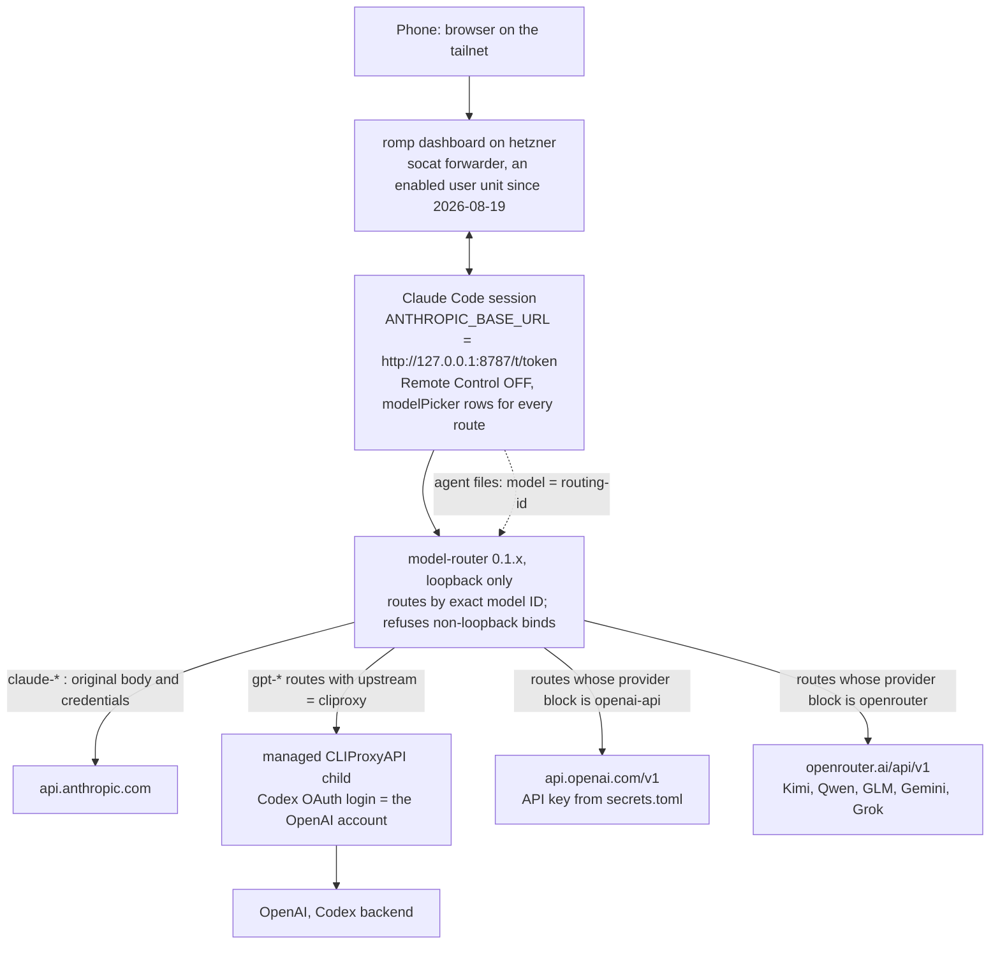
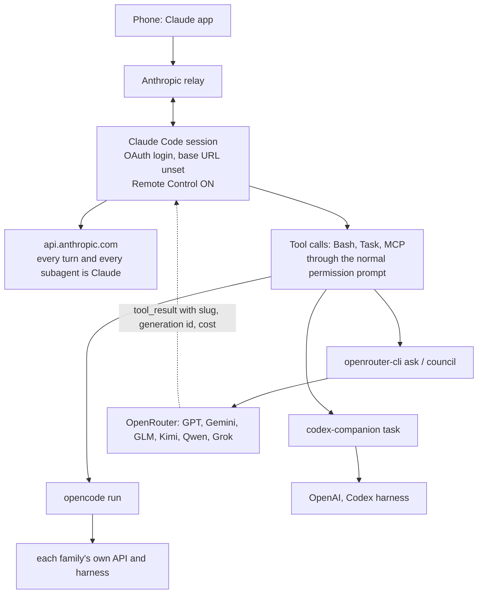
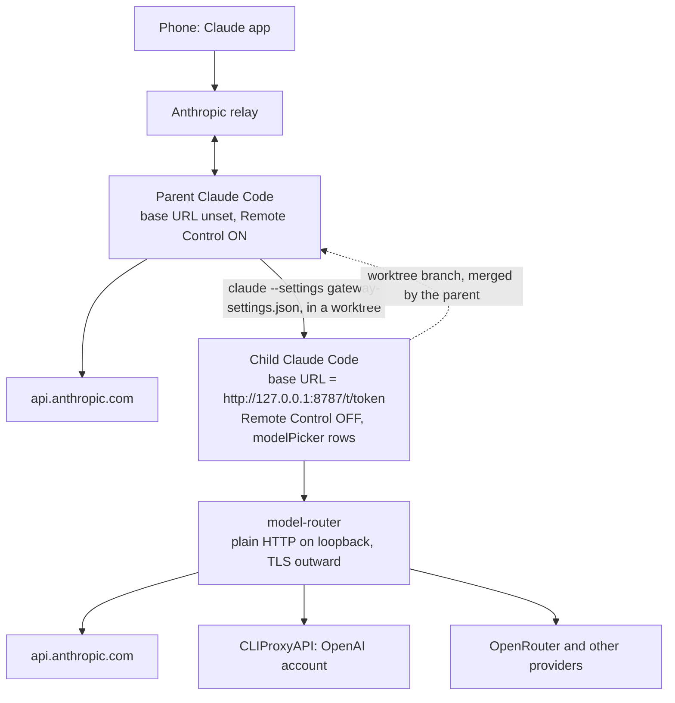

# Every Session Goes Through the Router

**Decision spec, 2026-09-06, revised the same day.** Consolidates the model-routing sessions of 2026-08 and 2026-09 into one design and one decision, written so another session can execute it from this page alone. The morning draft recommended the tool layer (Option A); Yulong chose Option C, the gateway in every session, with OpenAI models served from an OpenAI account or the OpenAI API rather than OpenRouter, provider per model configurable. Options A and B are preserved in full below and in this repo's git history. It supersedes the recommendation sections of [Remote Control and foreign models](https://claude.ai/code/artifact/dfd9f494-031b-4ca3-be8b-10c73e4a45ac) (2026-09-02) and [The Remote Control Inversion](https://claude.ai/code/artifact/fadb27e4-dd05-40b2-940e-3fb674ca6251) (2026-08-19), and it corrects two of their findings: the silent fallback (F3 below) and the claim that the assume-first-party flag is exempted from the Remote Control check (F1 below; it is not). Every function body quoted below was re-read from Claude Code 2.1.263 today (F1, F2). Behaviour that needs the client run (F3, the proxy route, `CLAUDE_CONFIG_DIR`) is inherited from the 2.1.252 and 2.1.222 measurements and carries its version where it appears. Evidence: `docs/remote-control-and-foreign-models.md`, and the model-router plugin's own log at `~/.claude/plugins/marketplaces/alignment-hive/plugins/model-router/docs/experiments.md`.

## The decision is executed and merged

**Added 2026-09-12.** This page is the decision record; the implementation it specifies landed separately in [PR #100](https://github.com/yulonglin/dotfiles/pull/100) (merged 2026-09-06, `e5d4420`) and has been extended since. Nothing on this page is waiting on a change to the repo — read it for *why* the routing looks the way it does, and read `.claude/rules/dotfiles-settings.md` for the operating rules in force.

| Piece of the design | Where it landed on `main` |
|---|---|
| The gateway env block, `modelPicker` rows and the "gateway is ON" rule | `.claude/rules/dotfiles-settings.md` § *The gateway is ON and lives only in the working copy* (PR #100) |
| One source of truth for every foreign model | `config/model-router.toml` (PR #100) |
| The renderer for router config, settings keys and agent files | `custom_bins/model-router-wire` (PR #100) |
| Foreign subagents named in agent files (step 5) | generated files under `claude/agents/` — `gpt-6-astra-high.md`, `glm-5.3.md`, `grok-4.6.md`, `kimi-k3.md`, `muse-spark-1.3.md` at PR #100; today `astra-high.md`, `sol-high.md`, `glm.md`, `grok.md`, `kimi.md`, `muse-spark.md` |
| The upgrade smoke test (step 10) | `tests/test_model_router_gateway.sh` (PR #100) |
| The `fallbackModel` drop (the "no silent fallback" criterion) | `aa33ffa` on PR #100 |
| Router recovery and update validation, added after this page | `claude/hooks/ensure_model_router.py`, `claude/hooks/check_model_router_update.py` |

Two statements on this page have been overtaken by later measurement, and are left in place because the page is dated evidence rather than a live manual:

- **F3's "silent Claude answer".** The execution record already traced it to `fallbackModel` rather than to the client. On 2.1.263, with that setting gone, an unserved model ID fails loudly (`There's an issue with the selected model`) — recorded in `CLAUDE.md` on 2026-09-07.
- **Step 1, the Unix-socket clause.** Still unrun. `archive/2026-09-06_rc-direct-settings/README.md` on `main` gives the recipe for it ("copy this file back to `claude/rc-direct-settings.json` for the duration and launch with `CLAUDE_RC_OVERRIDE=1`") and no result has been recorded anywhere since, so Remote Control is off under the gateway and romp is the remote path. That is the state `.claude/rules/dotfiles-settings.md` describes today.

## Overview

The ask across those sessions was one thing: a Claude Code session that treats non-Claude models (GPT, Gemini, GLM, Kimi, Qwen, Grok) as first-class citizens, in the `/model` picker and as subagents named in agent files, ideally without losing native Remote Control. The facts below say the first half is available today through the model-router gateway that ran here in 2026-08, and the second half is not: the Remote Control gate is a raw host check that no flag rescues. The decision is to take the first half in every session and replace Remote Control with romp, the parallel-session dashboard over Tailscale, while one cheap experiment (the Unix-socket clause in the same gate) is run first because it is the only thing that could give both.

### Five facts fix the design space

| # | Fact | Evidence | Consequence |
|---|---|---|---|
| F1 | Remote Control is available only when `ANTHROPIC_UNIX_SOCKET` is set or when `ANTHROPIC_BASE_URL` is unset or has host `api.anthropic.com`. The host is compared as a string; nothing is resolved. The assume-first-party flag does not count: the binary carries the message "_CLAUDE_CODE_ASSUME_FIRST_PARTY_BASE_URL does not apply to Remote Control." | 2.1.263: `eG(){if(!xn())return!1;return!!a.ANTHROPIC_UNIX_SOCKET\|\|Qv()}`, `Qv(){let e=process.env.ANTHROPIC_BASE_URL;if(!e)return!0;return Gw(e)}`, `Gw(e){try{let t=new URL(e).host;return["api.anthropic.com"].includes(t)}` | A loopback base URL turns Remote Control off in that process. The Unix-socket clause is the one untested way through (step 1 of the plan) |
| F2 | Gateway model discovery, which fills `/model` from `<base>/v1/models`, has four conditions: `CLAUDE_CODE_ENABLE_GATEWAY_MODEL_DISCOVERY` set, the first-party provider selected (not Bedrock, Vertex or Foundry), the base URL set, and that URL failing the same first-party check, which also means it is off whenever the assume-first-party flag is set. | `Dp(){if(!a.CLAUDE_CODE_ENABLE_GATEWAY_MODEL_DISCOVERY)return!1;if(Le()!=="firstParty")return!1;if(po())return!1;if(!a.ANTHROPIC_BASE_URL)return!1;return!0}`, `po(){if(a._CLAUDE_CODE_ASSUME_FIRST_PARTY_BASE_URL)return!0;return Qv()}` | Discovery is not the way to get picker rows; F4 is. The hosts-file variant the 2026-09-02 report asked to test cannot show a menu and is closed |
| F3 | An unrecognised model ID answers from the default Claude model **when no gateway is configured**: measured on 2.1.252 for `--model` and for an agent file, with only a stderr line. Behind the router the same agent-file field works: the model-router plugin measured `model: gpt-5.6-sol` in an agent file reaching GPT on 2.1.216 through 2.1.246, and it ships six such agent files. | `docs/remote-control-and-foreign-models.md` Finding 1; plugin `experiments.md` ("the documented full-model-ID allowance is the frontmatter/SDK field, which works"; "acceptance no longer depends on the var" from 2.1.246) | The 2026-09-02 conclusion "a foreign subagent by name is impossible on every route" was wrong for the router route. What stays true: without a gateway the ID is silently replaced, and the plugin's last measurement predates 2.1.252, so step 6 re-measures it on the current binary before anything relies on it |
| F4 | Picker rows for routed models come from a `modelPicker` key in `~/.claude/settings.json` on 2.1.242 and later; project and local files are ignored for it. The single `ANTHROPIC_CUSTOM_MODEL_OPTION` slot is the fallback below that version. | plugin setup skill, step 5; `experiments.md` "modelPicker vs the custom-model env pair" | A full foreign menu needs neither discovery nor a hosts trick |
| F5 | The Agent tool's per-call `model` parameter is a closed enum (`sonnet`, `opus`, `haiku`, `fable`); it rejects a routing ID before dispatch. Agent files and Workflow `opts.model` accept any string. | plugin `experiments.md`, "Dynamic general-purpose delegation" (2.1.216, re-verified 2.1.246) | Foreign subagents are named in agent files, one file per model and effort, exactly as the plugin ships them |

### Where the earlier sessions left the machine

A snapshot taken on 2026-09-06 **before** the plan below was executed, kept as the baseline the plan was written against. For the state after execution, see the status table above.

| Piece | State on 2026-09-06, before execution |
|---|---|
| `ANTHROPIC_BASE_URL` | unset in the committed and the deployed `settings.json`; Remote Control works; `remoteControlAtStartup` is `true` |
| model-router, the 2026-08 gateway | the `model-router` plugin from the `alignment-hive` marketplace, Rust binary v0.1.13 cached under `~/.cache/model-router`, service uninstalled 2026-08-18, plugin not in `enabledPlugins` (only the marketplace is); config at `~/.config/model-router/config.toml` still lists OpenRouter as an `[[openai-providers]]` entry with Kimi K3, Qwen3.8 Max, GLM 5.2 and Muse Spark 1.2 routes; a Codex OAuth login from 2026-08-14 sits in `~/.local/state/model-router/codex-auth`; the ingress token and CLIProxyAPI config are in the same state directory |
| Provider auth the router already knows | Claude requests are forwarded to `api.anthropic.com` with their original body and credentials; GPT routes go to a managed CLIProxyAPI child that holds the Codex OAuth login (an OpenAI account, not an API key); any OpenAI-compatible endpoint is one `[[openai-providers]]` block with its key in `secrets.toml` |
| `openrouter-cli`, `council`, `fusion` | live; seats pinned in `config/openrouter-models.toml`; every rung logs requested and resolved slug per role and usage to `calls.jsonl`, but a generation id only for `ask` and `fusion`, the chair's alone for `council ask`, and none for `advise`. They stay as the tool-layer path for one-off questions and panels |
| `codex-companion`, `opencode run` | live agentic workers in their own harnesses; no shared provenance log; `opencode` on PATH resolves to the bun shim rather than the repo wrapper |
| Agent files naming a foreign model | none since 2026-08-25, deleted on the F3 reading this page corrects |
| romp | installed on hetzner (`docs/romp-tailnet-access.md`), reached from the phone through a socat forwarder on the tailnet IP; that forwarder and the manager are enabled, active systemd user units (`romp-tailnet-proxy.service`, `romp-manager.service`, active since 2026-08-19), so the doc's "does not survive a reboot" line is stale and the other session is correcting it |
| `claude/rc-direct-settings.json` | blanks the gateway env keys for Remote Control sessions; prepended by the `claude()` wrapper and by `claude-spawn`, pinned by two tests; a no-op today and unnecessary under Option C |
| `claude()` wrapper auth | strips `ANTHROPIC_API_KEY` and `ANTHROPIC_AUTH_TOKEN` at launch (2026-09-02), so sessions run on the OAuth login |
| Guards | the pre-commit hook refuses a staged `settings.json` carrying `ANTHROPIC_BASE_URL` or a loopback URL with a token path; `tests/test_pre_commit_gateway_guard.sh` pins it |

## Requirements

- **MUST show a full foreign menu in every session**: GPT, and the OpenRouter families, as `/model` rows and as subagents named in agent files, with the row's real context window declared.
- **MUST serve OpenAI models from an OpenAI account or the OpenAI API, not OpenRouter**, and the choice is configuration: the Codex OAuth login that CLIProxyAPI holds for the account path, an `[[openai-providers]]` block with base URL `https://api.openai.com/v1` and a key in `secrets.toml` for the API path, and each routed model names which one it uses.
- **MUST keep every other family configurable the same way**: OpenRouter stays the provider for Kimi, GLM, Qwen, Gemini and Grok unless a block says otherwise, and swapping a model's provider is a config edit plus a service restart, never a code change.
- **MUST have a remote path that survives a reboot.** Remote Control is off under this design, so romp is the phone's way in; its forwarder already runs as an enabled user unit, and the acceptance test is a reboot, not a reading of the unit file.
- **MUST never present a Claude answer under a foreign label.** The router refuses to fall back to Anthropic on a foreign-route error, agent files and picker rows name only routes the router serves, and every foreign result the tool layer returns carries provider, echoed slug, generation id and tokens.
- **MUST keep the ingress token out of the public repo.** The router's base URL embeds a per-install token, so the deployed `settings.json` carries a permanent diff that the pre-commit guard refuses; the daily sync already holds the file back when the guard rejects it.
- **MUST leave TLS intact on every external hop.** Loopback is the only plaintext leg; nothing terminates TLS on the session's traffic.
- **SHOULD keep Remote Control if the Unix-socket clause of F1 turns out to work.** It is tested first and adopted if it holds; the design does not depend on it.
- **SHOULD keep the tool-layer workers**, because a council or a one-off question is still cheaper and better-logged through `openrouter-cli` than through a session's model.

## Decision

**Option C is adopted: the model-router gateway returns in every session, with GPT served from the OpenAI account through Codex OAuth by default and from an OpenAI API key where a route says so, OpenRouter for the other families, and romp as the remote path. Remote Control is given up unless step 1 of the plan shows the Unix-socket clause keeps it.** Decided by Yulong on 2026-09-06 after the morning draft; the reasoning behind the morning recommendation is preserved under Option A and is not repeated here.

What the choice buys, stated once: a foreign model in the real Claude Code loop, with hooks, CLAUDE.md and repo tools, selectable from the picker and nameable in an agent file, in the session you actually use. What it costs: the phone app's relay, an unsupported gateway session as the daily driver on a binary that updates most days, the session's Anthropic traffic passing through a loopback process, and the OpenAI account's Codex subscription being spent by Claude Code sessions.

## Option C design

Since the implementation, each routed model is one entry in `config/model-router.toml` in this repo, and `model-router-wire apply` renders the router's own `~/.config/model-router/config.toml`, the settings keys and picker rows, and the agent files from it. In the router's config the provider is chosen per entry: a `[[models]]` entry with `upstream = "cliproxy"` is the account path; a model under an `[[openai-providers]]` block is the API path for that block's base URL. So "GPT from the account, GPT-mini from the API key, Kimi from OpenRouter" is three entries and nothing else. The router's `config-template` prints the annotated form of every key named here; `verify-providers` checks each provider block against its `/models` endpoint without printing keys; `doctor --json` returns the base URL to wire and the list of routed IDs to turn into picker rows.

Picker rows come from `modelPicker` in the user `settings.json` (F4), one per routed ID, and are never checked against the router, so a row is removed when its route goes. The rows Yulong asked for on 2026-09-06 are GPT-6 Astra, GPT-5.6 Sol, Kimi K3, GLM 5.3, Muse Spark 1.3 and Grok 4.6. The two GPT rows are account-path routes (`upstream = "cliproxy"`; Codex already serves `gpt-6-astra`, which `codex/config.toml` pins), not the OpenRouter slug `openai/gpt-6-astra`, because the second requirement puts OpenAI models on the account or the API key. The other four are OpenRouter routes under the council roster's slugs: `moonshotai/kimi-k3`, `z-ai/glm-5.3`, `meta/muse-spark-1.3`, `x-ai/grok-4.6`. Subagents come from agent files (F3, F5): one file per model and effort, as the plugin ships for GPT, plus one per OpenRouter route. Tool-layer workers stay: `openrouter-cli` for panels and one-offs, `codex-companion` when a GPT worker should run in its own harness.

### The one experiment that could keep Remote Control

F1's gate has a second clause: `ANTHROPIC_UNIX_SOCKET` set passes it. In the binary that variable is the transport for `claude ssh` remote sessions ("ANTHROPIC_UNIX_SOCKET is set (claude ssh remote), and the local proxy is API-key-authed"), the API dispatcher routes Anthropic calls over the socket when it is set, and OAuth is then taken from `CLAUDE_CODE_OAUTH_TOKEN`. A first-party mechanism for "a local proxy in front of the API" is exactly the shape of a loopback router. Untested: whether the router can be reached through a Unix socket (a socat bridge from a socket to `127.0.0.1:8787` would do for the test), whether the Remote Control bridge then connects, and whether the session's requests actually traverse the router. The test is under an hour and fully reversible, so it runs first; if it holds, Option C keeps Remote Control and romp becomes the fallback rather than the path.

### Implementation plan, for the executing session

Each step names its check. Commands go through the plugin's bootstrap once the plugin is enabled; until then the cached binary at `~/.cache/model-router/v0.1.13/model-router` answers `--help`, `config-template` and `doctor`. Nothing in this repo is edited until step 4.

1. **Test the Unix-socket clause** (30 minutes, reversible). Start the router in the foreground with the cached binary, bridge a socket to it with socat, run one interactive `claude` with `ANTHROPIC_UNIX_SOCKET=<socket>`, `CLAUDE_CODE_OAUTH_TOKEN` from `claude setup-token`, no `ANTHROPIC_BASE_URL`, and `--model gpt-5.6-sol`. Check three things: the router log shows the request; the answer names a GPT model when asked which model it is; `/remote-control` connects and the session appears in the phone app. Record all three on this page whatever the outcome. If all three hold, the wiring in step 4 uses the socket variables instead of the base URL and the Remote Control cleanup in step 8 is skipped.
2. **Enable the plugin and install the service.** `claude plugin install model-router@alignment-hive --scope user`, then the plugin's setup skill: `bootstrap.sh doctor`, `ensure-upstream`, `login` only if doctor does not find the 2026-08-14 Codex auth, `service install`, `doctor` until green. The cached binary was v0.1.13 from the 2026-08 install; plugin 0.1.23 pins router 0.1.16 and CLIProxyAPI v7.2.132, which the first `doctor` and `ensure-upstream` fetched on 2026-09-06 (done by the implementing session; the Codex login was found, no interactive login needed). `service refresh` is the command for later bumps. Check: `systemctl --user status` shows the router unit active and `doctor --json` returns a base URL on port 8787 with the three GPT routes.
3. **Configure providers.** Extend `config.toml`: keep the three GPT `[[models]]` on `upstream = "cliproxy"`; add an `[[openai-providers]]` block named `openai-api` with base URL `https://api.openai.com/v1` and at least one model under it, with its key in `secrets.toml` under `[openai-providers] openai-api = ...`, sourced from `secrets get OPENAI_API_KEY`; keep the `openrouter` block and refresh its model list from the council roster in `config/openrouter-models.toml`, one entry per seat that OpenRouter serves. `service restart`, then `verify-providers`. Check: every provider block answers its `/models` probe and `doctor` lists every routing ID.
4. **Wire the session.** In the deployed `~/.claude/settings.json` (never the committed copy) add the `env` keys from the setup skill's step 5 (`ANTHROPIC_BASE_URL` from `doctor --json`, `_CLAUDE_CODE_ASSUME_FIRST_PARTY_BASE_URL`, `ENABLE_TOOL_SEARCH`, `CLAUDE_CODE_MAX_CONTEXT_TOKENS`) and a `modelPicker` block with one row per routed ID. Confirm the pre-commit guard refuses the staged file and that `dotfiles-sync` holds it back. Apply the `fallbackModel` decision below in the same edit. Check: a fresh session shows every route in `/model`, `doctor` is green including its `fallback-model` check, and `claude -p --model gpt-5.6-sol "which model are you"` answers as GPT with the router log showing the hop.
5. **Agent files.** Restore foreign subagents as agent files under `claude/agents/`, one per routing ID and effort, in the plugin's shape (`model: <routing-id>`, `effort:`), for the GPT routes and for each OpenRouter route; the four files deleted on 2026-08-25 come back under their current seat names. Check: a Task call with `subagent_type` set to one of them returns a transcript whose first assistant message names the foreign family, and the router log shows the routed ID.
6. **Re-measure F3 on the current binary.** With the gateway wired, run the 2026-09-02 probe again: an agent file with a routing ID the router serves, and one with an ID it does not. Record both results here. The served ID must reach the router; the unserved one must fail loudly rather than answer as Claude, and if it answers as Claude the router's picker rows and agent files are the only names allowed anywhere.
7. **Prove the remote path.** The forwarder is already `romp-tailnet-proxy.service`, enabled and active since 2026-08-19; confirm it is listed in `deploy.sh`'s enumerated unit loop so a fresh deploy installs it, then reboot hetzner and open the romp URL from the phone. Turning on Tailscale DNS on the phone remains the way to retire the forwarder, and is optional.
8. **Remove what only existed to reconcile a global gateway with Remote Control**, now that Remote Control is off by design: `claude/rc-direct-settings.json` and its deployed copy, the Remote Control block of the `claude()` wrapper in `config/aliases/claude.sh` including the `--model gpt-5.6*` skip, the rc-direct prepend in `custom_bins/claude-spawn` (its `--settings` block for that file and the `CLAUDE_RC_OVERRIDE=0` opt-out), the two tests that pin that prepend, `tests/test_claude_spawn.sh` and `tests/test_claude_wrapper_rc.sh`, and `remoteControlAtStartup` in settings. Keep the pre-commit guard and its test. Skip this step if step 1 held.
9. **Update the words.** `CLAUDE.md` Learnings; `.claude/rules/dotfiles-settings.md`, which describes exactly this working-copy diff and needs its "currently OFF" paragraph flipped; the `council` skill's "non-Anthropic models cannot be reached through subagents" paragraph, which is true only without a gateway; `rules/delegation.md` line 13 likewise; `openrouter-fusion` skill; `ARTIFACTS.md` row for this page.
10. **Smoke test as one command**, kept under `tests/`: router unit active; `doctor` green; each routed ID answers a fixed probe naming its family; each provider block passes `verify-providers`; the deployed settings carry the base URL and the committed file does not; romp answers over the tailnet. Run it after every Claude Code upgrade and every router refresh.

### Execution record, 2026-09-06

Measured by the implementing session on Claude Code 2.1.263, model-router 0.1.16 (plugin 0.1.23), CLIProxyAPI v7.2.132, on hetzner; its changes are on branch `worktree-option-c-gateway`.

| Step | Result |
|---|---|
| 1, Unix socket | Yulong runs it himself (decided about 09:35 UTC, relayed); the commands were handed over with the auth caveat that the socket path is described as API-key-authed and Remote Control needs the OAuth login, so an auth failure must be told apart from a gate failure. Step 8 waits for his verdict |
| 2, plugin and service | done; plugin enabled at user scope, `model-router.service` active, `doctor` green on every check except `fallback-model` |
| 3, providers | done; four account-path `[[models]]` routes (`gpt-6-astra`, `gpt-5.6-sol`, and the shipped `terra` and `luna` so the plugin's own agents keep resolving) and an `openrouter` block with `kimi-k3`, `glm-5.3`, `muse-spark-1.3`, `grok-4.6`; `verify-providers` passes; the Codex backend's `/v1/models` lists `gpt-6-astra`, so Astra is on the account path; GLM's host-guaranteed window is 262144, not the catalogue's 1048576, and that is what is configured. No `openai-api` block: see the decision below |
| 4, wiring | done through a new `custom_bins/model-router-wire`; the deployed `settings.json` carries the env block and exactly the six rows; the committed copy carries only `enabledPlugins`. Later the same morning `config/model-router.toml` became the single source for every foreign model (provider, slug, window, enabled, picker row, agent file), `model-router-wire apply` renders the router config, the settings keys and picker rows, and the generated agent files from it, and `status` reports drift. All of it is in PR #100 on branch `worktree-option-c-gateway`, which Yulong asked the implementing session to merge after the re-measurement |
| 5, agent files | done: `gpt-6-astra-high`, `kimi-k3`, `glm-5.3`, `muse-spark-1.3`, `grok-4.6` under `claude/agents/` |
| 6, F3 re-measured | served routes: `claude -p --model <id>` for all six answers as its own family with one router-log line per routing ID, and an agent with `model: kimi-k3` answered as Kimi K3 with the hop in the log. Unserved name: an agent with `model: zz-unserved-probe` was routed by the router on its Claude branch to Anthropic (`branch=claude model=zz-unserved-probe`), and the reply was Claude with no error surfaced, because `fallbackModel` re-ran the failed request on Opus. So on 2.1.263 the agent-file ID does go out on the wire, F3's silent replacement is not the mechanism, and the silent Claude answer now comes from `fallbackModel` |
| 7, remote path | `deploy.sh` already enumerates `romp-tailnet-proxy.service`; the reboot is Yulong's |
| 8, Remote Control teardown | skipped pending step 1 |
| 9, words | done for the implementing session's files: `.claude/rules/dotfiles-settings.md`, `docs/romp-tailnet-access.md`, `claude/rules/delegation.md`, the council skill section, the `openrouter-cli` preamble; this page, the CLAUDE.md decision entry and the `ARTIFACTS.md` row by this session |
| 10, smoke test | `tests/test_model_router_gateway.sh` with legs unit, doctor, providers, settings deployed and committed, one route probe per ID, agent served and unserved probes, agent-file audit, romp; first run 2026-09-06 around 09:20 UTC failed on `doctor` and `agent:unserved`, both the `fallbackModel` setting. Re-run at 2026-09-06T09:35:54Z after the drop (commit aa33ffa on PR #100, applied to the deployed file): every leg passes; `doctor` green on every check; an agent with `model: gpt-5.6-sol` answered "GPT-5.6 Sol." with the hop logged; an agent with `model: zz-unserved-probe` surfaced "Error: There's an issue with the selected model (zz-unserved-probe). It may not exist or you may not have access to it." instead of a Claude answer |

## Acceptance Criteria

Someone else verifies the design is in force by checking these; each names its test.

- **Every route is in the picker and answers as itself.** For each row in `modelPicker`, `claude -p --model <id> "state your model family in one word"` returns that family, and the router log shows one request for that routing ID.
- **OpenAI models are served from the configured OpenAI path, not OpenRouter.** With the OpenRouter key removed from `secrets.toml`, GPT routes still answer; with it restored and the Codex auth directory moved aside, the account-path GPT routes fail loudly and the API-path route still answers.
- **A provider swap is configuration only.** Moving one model between the `openrouter` block, the `openai-api` block and `upstream = "cliproxy"` needs one config edit and `service restart`, and `verify-providers` passes afterwards.
- **Foreign subagents by name work and unserved names fail loudly.** Step 6's two probes are recorded in the execution record with the binary version. On 2026-09-06 at 09:20 UTC the unserved ID failed this criterion because `fallbackModel` re-ran the request on Opus; at 09:35:54Z, with the setting dropped, both probes pass on 2.1.263 and router 0.1.16.
- **No silent fallback to Claude.** A foreign route returning an upstream error surfaces as an error in the session; the router log has no Anthropic request for that turn. This holds only with `fallbackModel` absent, and the router's `doctor` says so: its `fallback-model` check fails while the setting is present. Met on 2026-09-06 at 09:35:54Z after the drop.
- **The public repo never carries the ingress token.** `git -C ~/code/dotfiles diff claude/settings.json` shows the env block; the pre-commit guard test passes; `git log -p -S'/t/' -- claude/settings.json` on `main` finds nothing new.
- **The remote path survives a reboot.** After `sudo reboot` on hetzner, the romp URL loads from the phone without a manual command.
- **Remote Control status is stated, not assumed.** The result of step 1 is recorded on this page with the binary version; if it held, `/remote-control` connects in a wired session; if not, `remoteControlAtStartup` is gone and the wrapper no longer references Remote Control.
- **Upgrades are checked.** The step 10 smoke test exists, passes on the current binary, and its last run is dated on this page.

## Preserved designs, not adopted

Kept in full so the reasoning is not rediscovered. Both were the morning's recommendation and escalation; both remain valid fallbacks if Option C breaks on a version bump.

### Option A: tool layer, Remote Control native

Claude Code runs exactly as Anthropic ships it. Foreign models are reached by tool calls, and their answers enter the transcript as tool results, which is also what makes provenance enforceable.

What it gives: Remote Control everywhere, TLS intact, supported by Anthropic, provenance for free on the OpenRouter side, and each foreign family runs in its own harness, which several council seats noted performs better than a foreign model driving Claude's loop through a shim. A Claude subagent restricted to these tools is, in effect, a routed subagent: it delegates to the family; it just does not become it.

What it gives up: no foreign row in `/model`, and no foreign model reads the live transcript as a true shared-context subagent. That residual gap is what Option C buys.

Its build list, still worth doing under Option C for the tool layer: provenance for `codex-companion` and `opencode` results; one spend log and a session cap across the workers; `timeout --signal=KILL` and captured stderr on the agentic rung; the `opencode` PATH order.

### Option B: split process, Remote Control parent and gateway child

The parent is Option A. When a foreign model needs the real loop and repo tools, the parent spawns a child Claude Code in a worktree with its own settings file pointing at the router. The child fails F1 and the parent never touches its base URL, so the parent's Remote Control is untouched.

What it gives: everything Option A gives in the parent, plus a child in which a foreign model drives the actual Claude Code loop with CLAUDE.md, hooks and repo tools. Nothing is bypassed: the child is an unsupported gateway session, which Anthropic's docs call unsupported rather than prohibited. The child can be headless (`claude -p --settings gateway-settings.json`), driven by the parent as one more tool call, which needs no spawn skill. Two constraints from the 2026-09-06 review: the child runs on an API key in its settings file rather than the inherited OAuth login, and its result comes back with the router's provenance attached so the parent can refuse a branch whose echoed model is Claude.

What it costs: the child has no Remote Control, so a long child run cannot be steered from the phone, and it pays API spend on top of the subscription. Under Option C the whole design collapses into "every session is the child", which is why it is not needed.

### Closed routes, recorded so they are not rediscovered

- **Host-preserving endpoint** (`ANTHROPIC_BASE_URL=http://api.anthropic.com` plus a hosts-file override). Passes the Remote Control gate and fails F2 by the same function, and F4 makes it pointless anyway: picker rows never needed discovery. Closed.
- **TLS-terminating proxy** (`https_proxy` plus your own CA). Technically open on 2.1.252 (no pinning, lowercase proxy variable honoured). Rejected on 2026-09-02 as the only route that decrypts the session's own OAuth traffic, and Option C makes it redundant.
- **A foreign model ID in agent frontmatter with no gateway.** F3 as measured: silently Claude. With the gateway it is the design.
- **A second install via `CLAUDE_CONFIG_DIR`.** The base URL is read from `settings.json` only (2.1.222).

### Side by side

| | A: tool layer | B: split process | C: gateway everywhere (adopted) |
|---|---|---|---|
| Remote Control | on, every session | on in the parent, off in the child | off, unless the Unix-socket clause holds; romp instead |
| Foreign `/model` rows | none | in the child, via `modelPicker` | everywhere, via `modelPicker` |
| Foreign subagent by name | no (F3 without a gateway) | in the child, via agent files | everywhere, via agent files |
| Foreign model with repo tools and the live loop | in each family's own harness only | yes, in the child | yes |
| OpenAI models from the OpenAI account or API | `codex-companion` only | yes, by router config | yes, by router config |
| Provenance | in every tool result | router log for the child | router log; tool layer as before |
| TLS on external hops | intact | intact; loopback is the only plaintext leg | intact; loopback is the only plaintext leg |
| Support status | supported | parent supported, child unsupported | unsupported |
| What a version bump can break | the tool CLIs, loudly | the child, on demand | the daily driver; the smoke test is the detector |
| Spend | subscription plus per-call API | plus API for the child | Codex subscription and API keys through the router |

## Reviewed before the revision, and what the review changed

Two reviews were run on the morning draft on 2026-09-06: a two-family council (`openrouter-cli council advise`, seats Claude Fable 5 and GPT-6 astra, both slugs echoed as requested), which reported, and a three-lens in-family workflow (fact-check against the repo and the binary, red-team of the decision, misread check, each finding adversarially verified by a second agent), which reported after the revision with twelve confirmed and twelve refuted findings; the six that still applied to the revised text were folded in (the intro's re-check claim, the earlier report's exemption claim, the council provenance cell, F2's four conditions, the two-URL bullet, the claude-spawn cleanup item), and the rest targeted passages the revision had already rewritten. Both council seats objected that the first MUST as written ("every interactive session") forbade Option B by definition, and both said "nothing left to test" overstated F3, which had been measured on unrecognised IDs without a gateway; the revision confirmed the second objection from the plugin's own log and rewrote F3. Fable supplied the headless child form of B; GPT supplied the API-key and provenance constraints on the child. The decision itself changed afterwards by Yulong's choice, not by the review. The raw answers are in `build/`, which is gitignored.

## One decision the plan surfaced, for Yulong

**`fallbackModel` against provenance.** The deployed `settings.json` sets `fallbackModel` to Claude Opus 5 then `opus`, added on 2026-09-02 so a Claude session survives an overload. The router's own `doctor` fails on it, and its text says why: a routed GPT or Grok subagent whose request the gateway fails with a 404 or a 5xx silently continues on the first Claude model of that chain instead of erroring. That is exactly the Claude-under-a-foreign-label case the fifth requirement forbids, and it is invisible in the transcript. The two settings cannot both hold, so this is a trade to make, not a bug to fix:

- **Remove `fallbackModel`** (the router's recommendation): routed requests fail loudly; Claude sessions lose automatic recovery from an overload and show the error instead, which the session can retry by hand.
- **Keep `fallbackModel`**: Claude sessions keep overload resilience; every routed subagent carries a silent path to Claude, and the provenance criterion above cannot be met.

The lean was remove: an overload on a Claude session is visible and recoverable, a silent substitution on a routed one is neither. Step 6 measured the failure on 2026-09-06: an unserved agent-file ID came back as Claude with no error, through this setting. **Decided: drop it** (Yulong, 2026-09-06 about 09:35 UTC, relayed by the implementing session). Removed from the deployed settings and the committed copy in PR #100 (aa33ffa); the re-measurement at 09:35:54Z in the execution record shows the unserved ID now erroring instead of answering as Claude.

**The OpenAI API-key path.** The only `OPENAI_API_KEY` in `secrets` is labelled with another person's name, so the implementing session added no `openai-api` provider block. **Decided: skip for now** (Yulong, same time, relayed). GPT stays on the Codex account path until a key that is his to spend exists; the second requirement's "or the OpenAI API" clause stays configured but unused.

## What this page does not decide

- **The 2026-09-02 report is published at two URLs.** Its `meta.yml` names [d224e859](https://claude.ai/code/artifact/d224e859-2f4d-452c-9781-5ab3941e57cf) and the `ARTIFACTS.md` row committed on `main` on 2026-09-06 adds [dfd9f494](https://claude.ai/code/artifact/dfd9f494-031b-4ca3-be8b-10c73e4a45ac). One should be marked superseded by the other and the `meta.yml` updated to match; this page links the newer.
- **Data governance of routed sessions.** Under Option C a session's repo text goes to whichever provider its model uses, under that provider's retention policy, and a subagent named in an agent file does so without a per-call prompt. The 2026-09-01 council flagged this for the tool layer; it is larger here and is not designed on this page.
- **The Codex subscription being spent by Claude Code sessions** was accepted on 2026-07-20 per the plugin's log, to be revisited before any public release of the plugin; this page inherits that acceptance and does not re-examine it.
