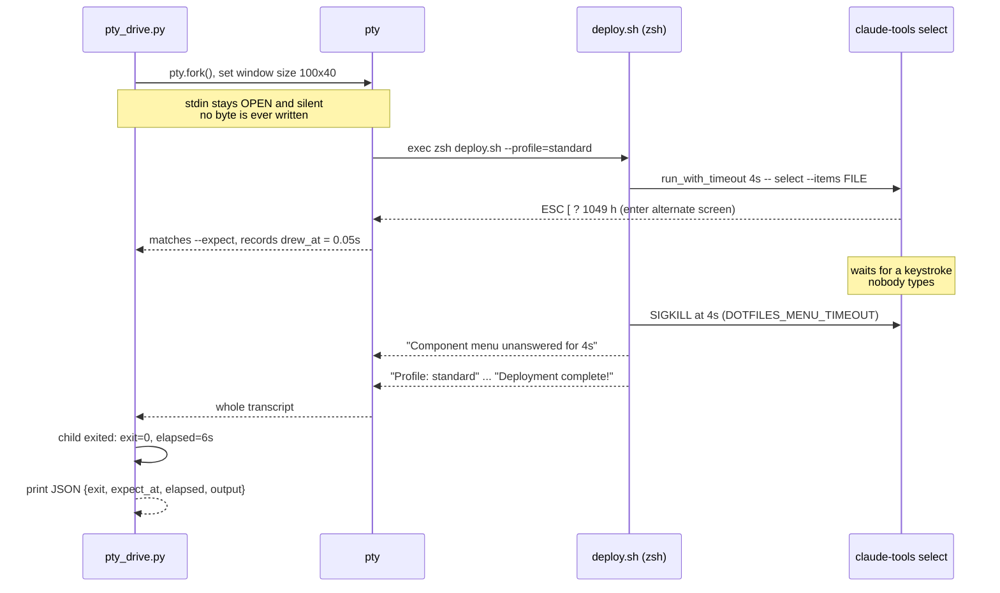

# The silent-pty installer harness

PR [#134](https://github.com/yulonglin/dotfiles/pull/134) adds three files and no product code: `tests/pty_drive.py`, `tests/test_installers_silent_pty.sh` and `tests/test_claude_tools_select.sh`. They exist because on 2026-09-04 `./install.sh` "did nothing", and every stall check in the repo stayed green while it happened.

**Verdict up front.** The harness is real and it reproduces the reported failure — I ran it, and it is red on `main` for the right reason. But three of its assertions can be satisfied by a menu nobody can use, and one case has no time bound at all. It is a good diagnostic today and not yet a gate. One added assertion and one added bound would close both holes.

## A TTY with nobody typing is the missing test

The component menu is guarded by `[[ -t 0 ]]`. If stdin is not a terminal the menu is skipped entirely and the run proceeds on defaults — so every ordinary test of the installer takes a code path the user never takes.

That leaves exactly one way to reach the buggy path, and three ways that look like it but are not.

| How you run it | What the installer sees | Reaches the menu? |
|---|---|---|
| `subprocess.run(...)` with a pipe | stdin is a pipe | No — `[[ -t 0 ]]` fails, menu skipped |
| `./install.sh < /dev/null` | a TTY-less fd that returns EOF at once | No |
| `script -c ./install.sh` (util-linux) | a real pty, but `script` forwards EOF from its own closed stdin | Menu runs and returns instantly — the existing CI step passes in 0.1 s |
| **a pty whose stdin stays open and silent** | a real terminal that never produces a byte | **Yes — this is a human who walked away** |

Only the fourth reproduces "I ran it and nothing happened". `pty_drive.py` is the fourth.

## The harness drives the installer through a pty



The harness never asserts anything. It reports four facts as JSON and the shell suite does the judging, which is why a stalled child is a measurement rather than a crash.

## Three different timeouts, three different jobs

Readers conflate these constantly, and the distinctions carry the whole design.

| Timeout | Lives in | Value here | What it does |
|---|---|---|---|
| `--deadline` | `pty_drive.py` | 90 s (case 1), 60 s (cases 2–3) | Harness SIGKILLs the child and reports `exit: null`. The outer safety net. |
| `DOTFILES_MENU_TIMEOUT` | `helpers.sh`, via `run_with_timeout` | 4 s in tests, 60 s in production | The **product's own** rescue. Kills the menu, logs a warning, keeps the pre-checked set. |
| `DEPLOY_WALL_BOUND` | the suite | 25 s | Pure assertion. A deploy slower than this is called a stall. |

The June bug survived two and a half months precisely because the middle one works. The deadline fired, the warning printed, the run continued, and every deadline-based check went green — while the user sat in front of a terminal that had drawn nothing.

## Stall detection is one escape sequence

`pty_drive.py` is handed `--expect '\x1b\[\?1049h'`. Those bytes are the ANSI **enter alternate screen** sequence, what a full-screen TUI emits before it paints. The harness searches the accumulated pty buffer after every read and records `expect_at`, the seconds until first match.

So "the menu drew" is operationalised as: *alternate-screen bytes appeared on the pty within 3 seconds.* Hold onto that — it is the load-bearing simplification and the source of the largest false negative.

The current binary reads its item list from **stdin at line 39** of `tools/claude-tools/src/select/mod.rs` and only enters the alternate screen at **line 71**. On a terminal that read blocks forever, so the alt-screen bytes never arrive and `expect_at` stays `null`. That is the whole detection.

## One case, from input to assertion

`test_deploy_menu_draws_then_deadline_keeps_profile`, the first case in `test_installers_silent_pty.sh`:

- **Input.** `drive 90 '' -- zsh deploy.sh --allow-worktree --allow-worktree-deploy --profile=standard --no-claude-tools --no-git-hooks --no-codex`. The empty second argument means no keystroke is ever sent. `HOME` is a scratch dir, `DOTFILES_MENU_TIMEOUT=4`, and `DOTFILES_SKIP_LOCAL_CONFIG=1` so `standard` means the same thing on every machine.
- **Run.** `pty_drive.py` forks a pty, execs zsh, and polls for up to 90 s.
- **Parse.** Four `python3 -c` one-liners pull `exit`, `expect_at`, `elapsed` and `output` out of the JSON into `DRIVE_EXIT`, `DRIVE_AT`, `DRIVE_ELAPSED`, `DRIVE_OUT`.
- **Judge.** Six checks, each appending a clause to a `why` string: the menu drew within 3 s; the idle-deadline warning is present; `exit == 0`; `elapsed <= 25`; `^Profile: standard` in the transcript; `Deploying tmux configuration` in the transcript; `Deployment complete!` in the transcript.
- **Report.** An empty `why` is a pass. Otherwise the failure line carries every clause at once, so one run tells you all six answers.

Note what case 1 asserts as the *expected* outcome: the menu drew, **and then timed out**, and the run recovered. It is a stall-and-recover test, not a no-stall test.

## Running it against main, unmodified

All three suites run on this Linux box (`zsh`, `python3` with `pty`, the committed `claude-tools-linux-x86_64`). Real output:

```
$ bash tests/test_installers_silent_pty.sh
  FAIL deploy.sh on a silent pty must draw the menu, time out, and deploy the profile
       menu never drew (drew_at=none);
  FAIL deploy.sh: Enter on the menu must deploy the pre-checked profile
       menu never drew (drew_at=none); deadline fired despite Enter;
  FAIL install.sh must draw the menu and survive Esc
       menu never drew (drew_at=none); deadline fired despite Esc;
passed: 0   failed: 3
```

Red for one reason only — `drew_at=none`. Note what is *absent* from those failure clauses: no `exit=`, no `took Ns`. The deploy completed fine and inside the bound. The menu is the only broken thing, which is exactly the report.

```
$ bash tests/test_installers_silent_pty.sh --mutate
(mutation active: stdin-binary, in a scratch copy of the repo)
passed: 0   failed: 1
Mutation caught: the suite goes red for the planted stdin-binary regression.

$ bash tests/test_installers_silent_pty.sh --mutate=bounded
(mutation active: bounded, in a scratch copy of the repo)
       menu never drew (drew_at=none); took 51s, bound is 25s — something waited;
Mutation caught: the suite goes red for the planted bounded regression.

$ bash tests/test_claude_tools_select.sh
  FAIL --items must draw and Enter must print the pre-checked names   drew_at=none exit=none
  FAIL an unknown flag must exit 2 at once                            exit=none drew_at=none elapsed=5s
  FAIL no --items on a terminal must be refused, not waited on        exit=none drew_at=none elapsed=5s
  FAIL Esc must exit 1                                                exit=none drew_at=none
passed: 0   failed: 4
```

Every claim in the PR description reproduced.

## A blank menu passes all three cases

This is the finding worth the most. I built a stub binary that enters the alternate screen, **renders nothing whatsoever**, and answers one keystroke. A user running it sees an empty screen with no components and no way to know what is selected. Planted into a scratch copy of the repo:

```
$ bash tests/test_installers_silent_pty.sh          # blank-rendering stub
  PASS deploy.sh on a silent pty: menu drew at 0.05s, deadline fired, profile deployed in 6s
  PASS deploy.sh: Enter confirms the pre-checked profile (drew at 0.048s)
  PASS install.sh on a silent pty: menu drew at 0.038s, Esc cancelled, run completed
passed: 3   failed: 0
```

Nothing in the suite asserts that a **component name ever reached the screen**. `drew_at` proves the TUI initialised, not that it is usable. The harness would have caught the June regression, and would miss any regression that fails after the alt-screen byte.

### The vacuity guard certifies the weaker half

A related shape: a stub that enters the alternate screen *first* and *then* blocks on stdin — the same user experience as June, a different byte order.

```
$ bash tests/test_installers_silent_pty.sh          # alt-screen-then-block stub
  PASS deploy.sh on a silent pty: menu drew at 0.047s, deadline fired, profile deployed in 5s
  FAIL deploy.sh: Enter on the menu must deploy the pre-checked profile   deadline fired despite Enter;
  FAIL install.sh must draw the menu and survive Esc                      deadline fired despite Esc;
```

Case 1 alone is blind to it. Only the keystroke cases catch it — and `--mutate` deliberately runs **case 1 only** ("each extra case waits out the planted regression's full deadline for no additional signal"). So the mutation check, the thing that proves the suite can fail, exercises the one case that cannot see the reordered variant. Whether the harness catches this class is an accident of where the current binary happens to block.

### The install.sh case has no time bound

Found independently by GPT-6 Astra, then verified here. Case 3 checks four things and `DRIVE_ELAPSED` is not among them: it asserts the menu drew, `exit == 0`, no idle warning, and `Installation complete!`. The driver deadline is 60 s, so anything under that passes. `--mutate=bounded` patches `deploy.sh` only, so the gap is not covered by the vacuity guard either.

Planting `sleep 45` after `show_component_menu install`:

```
exit    = 0
drew_at = 0.039
elapsed = 45.355
completion line present: True
idle-deadline warning present: False
```

All four of case 3's assertions hold. A 45-second stall in `install.sh` is a pass — the same bounded stall the branch explicitly sets out to reject on the deploy path.

### The remaining gaps are smaller

- **Sub-19-second stalls are invisible on deploy.** A clean run measures ~6 s against a 25 s bound. The bounded mutation plants 45 s; a 15 s regression would pass silently.
- **`select` case 1 does not test stdout.** stdout and stderr share one pty, so `$J_OUT == *tmux*` matches the *rendered frame*. A stub that renders correctly and prints nothing on Enter passes: `PASS --items on a silent pty draws (at 0.003s); Enter prints the pre-checked names`. Production captures stdout with `result=$(...)`, so the test's fd topology is not production's. Minor — the negative check does read stdout, but it relies on the frame never containing that one literal.
- **The 1 MB cap keeps the tail.** `output = buf[-1_000_000:]`, and the greps target lines printed *early*. Cases 2 and 3 assert the idle warning is **absent**, so a TUI emitting over 1 MB of redraws would flip them green. Unlikely, but that is the direction.
- **Out of scope by design, not defects.** `install.sh` runs only `--minimal`, so the package-installation path — where an `apt` or `brew` prompt would actually hang — is untested. `claude-tools`, `git-hooks` and `codex` are switched off on the deploy path. Neither suite is wired into CI. All three are stated in the PR.

## The one assertion that closes the headline hole

Assert that a component name reached the menu's own frame. Slice the transcript from the alt-screen enter byte to whichever comes first, the alt-screen leave byte or the idle-deadline warning, because `timeout` SIGKILLs the menu and a clean leave is often never emitted. Slicing matters: the post-menu `Deploying tmux configuration` line would satisfy a naive whole-transcript grep.

Verified in both directions on the two stubs above:

```
blank-rendering stub:  RED   — the menu frame is 12 bytes and contains no component name
rendering stub:        GREEN — a component name is rendered in the menu frame (2100 bytes)
```

Alongside it: give case 3 an elapsed bound, and extend `--mutate=bounded` to `install.sh` with that case enabled.

## Adding a case

Every case follows one shape, and the shape is worth keeping.

- Call `drive <deadline> <send-or-empty> -- cmd args...`. The second argument is a Python-escaped byte string sent 0.3 s after the alt-screen match (`'\r'` for Enter, `'\x1b'` for Esc), or `''` to send nothing. It sets `DRIVE_EXIT`, `DRIVE_AT`, `DRIVE_ELAPSED` and `DRIVE_OUT`.
- Accumulate failures into a local `why` string rather than returning early, so one run reports every broken assertion instead of only the first.
- Always bound the wall clock. `(( DRIVE_ELAPSED <= SOME_BOUND ))` is the only thing separating "finished" from "eventually gave up", and its absence is the case-3 hole above.
- Assert on **content**, not only on liveness. `drew_at` and `exit` say the process behaved; a grep for something a user would actually see says the feature worked.
- Register it in the run block near the bottom, and decide whether it belongs inside the `if [[ "$MUTATE" != true ]]` guard. Anything the mutation check does not run is a case with no vacuity proof.
- Give it a mutation. Plant the regression it claims to catch, confirm red, and confirm red *for the planted reason* — the suite already greps `FAIL_DETAILS` for a specific substring rather than accepting any failure.

## Running the suites

```
bash tests/test_installers_silent_pty.sh                  # ~15 s
bash tests/test_installers_silent_pty.sh --mutate         # ~6 s
bash tests/test_installers_silent_pty.sh --mutate=bounded # ~55 s
bash tests/test_claude_tools_select.sh                    # ~27 s
```

Preconditions fail loudly rather than skipping: no `python3` with `pty`, or a missing platform binary, exits 1 with a build recipe. That is deliberate — a suite that passes because its subject was absent is the vacuous pass these files exist to end.

## Reviewers

- Claude Opus 5 — this review, the stub experiments, and the verified assertion above.
- GPT-6 Astra via `codex-companion adversarial-review` (codex-cli 0.153.4, reasoning effort ultra) — verdict `needs-attention`, one medium finding: the missing elapsed bound on the `install.sh` case, reproduced here at 45.355 s.
