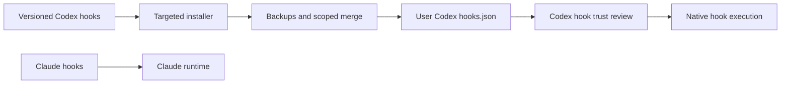

# Codex hook compatibility repair (2026-09-08)

Codex was running a June copy of Claude hooks outside the repository. File reads
were denied in favor of nonexistent Read/Edit tools; startup hooks displayed a
Claude login and could update Claude profiles, while stop hooks parsed or wrote
Claude transcripts. The permission classifier also resolved its secret helper
to a nonexistent path. The ordinary sync script did not own any of these files.

## Maintained behavior

| Previous registration | Codex behavior |
|---|---|
| Tool nudge blocking cat/sed | Advisory rg/apply_patch guidance; ordinary reads allowed |
| Loop guard reading CLAUDE_TOOL_INPUT | Reads normalized stdin tool_input.command; handles multiline bodies |
| Network audit | Retained; logs under ~/.cache/codex |
| Dependency warning using message | Uses hookSpecificOutput.additionalContext |
| Git root, venv and NOTES.md startup checks | Read-only, payload cwd, bounded notes read as data |
| Claude Task, WebFetch, Chrome and old Gmail matchers | Retired; these tools or payloads do not map directly |
| Claude auth, profile sync, agent tracking and watchdog | Retired from Codex |
| Anthropic approval classifier and transcript renamer | Retired; native Codex approval policy remains |
| Companion lifecycle and Ralph Stop | Individual hook states disabled; plugin skills retained |
| Core/workflow malformed inline manifests | Native empty-hook overlays preserve their previously inert hooks |
| Remember native Codex hooks | Retained |



## Deploy and verify

The two installers default to preview and accept --target for an isolated home:

```sh
python3 scripts/setup/sync_codex_hooks.py
python3 scripts/setup/repair_codex_plugin_hooks.py
python3 scripts/setup/sync_codex_hooks.py --apply
python3 scripts/setup/repair_codex_plugin_hooks.py --apply
```

The normal scripts/sync_claude_to_codex.sh calls both. Use these targeted
installers for an existing standalone ~/.codex directory. Full deploy.sh --codex
still performs its older whole-directory migration with a limited runtime-file
allowlist; that migration is outside this repair and was not run or validated. The root
installer retains unknown hooks, backs up changed files under ~/.codex/backups,
and appends a bounded compatibility block to the existing AGENTS.md. The plugin
installer preserves unrelated TOML bytes and backs up config.toml beside itself.
It creates overlays only for known malformed legacy manifests without replacing
an existing native manifest. Rerun after plugin updates to cover new cache versions.

Open a fresh Codex session and use /hooks to review changed hook definitions.
Trust hashes are deliberately not fabricated by the installer. An already-open
session may retain cached registrations; the nudge compatibility shim repairs
its old script path, but lifecycle changes need a fresh session.

```sh
python3 -m unittest discover -s tests -p 'test_*codex*hooks.py' -v
shellcheck -x codex/hooks/*.sh scripts/sync_claude_to_codex.sh
```

Tests use real subprocess hook calls with JSON inputs and isolated temporary
homes. Forbidden shell commands are input strings and are never executed.
The inherited loop guard remains a literal-pattern check, including quoted-text
false positives; it is not a complete shell parser or the sandbox boundary.

Hook event names, Bash normalization, additionalContext, plugin manifests and
trust behavior were checked against the [Codex hook documentation](https://developers.openai.com/codex/hooks).
The four plugin hook state keys were checked against the
[0.153.4 hook discovery implementation](https://raw.githubusercontent.com/openai/codex/rust-v0.153.4/codex-rs/hooks/src/engine/discovery.rs).

## Validation on this Mac

- All 38 tests passed; shellcheck passed the hook scripts and sync entrypoint.
- Both installers were applied to ~/.codex; subsequent previews reported zero changes.
- All five deployed handlers accepted benign Codex-shaped input in subprocess probes.
- The original cat and sed reads now succeed through the live tool hook path.
- Startup/plugin reload and trust review remain to be confirmed in a fresh session.

Backups for this application: ~/.codex/backups/hooks-20260908T092247.391565Z
and ~/.codex/config.toml.bak.codex-hooks-20260908T092259.555453Z.
